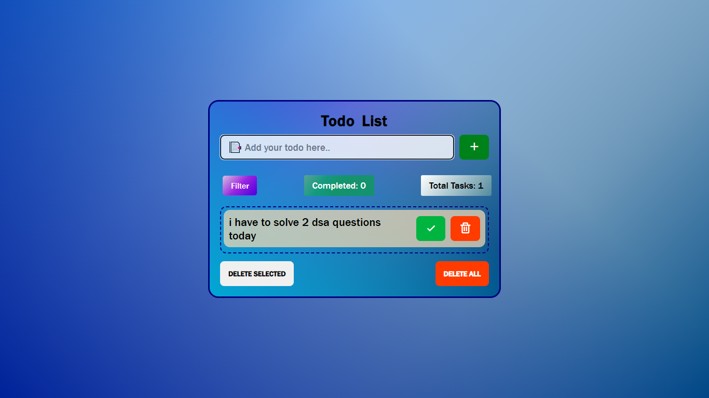

# To-Do App

A simple and efficient To-Do app to organize your tasks, stay productive, and manage your daily goals. Built with HTML, CSS, and JavaScript, this app allows users to add, edit, and remove tasks in an intuitive interface.



## Features

- **Add tasks**: Quickly add tasks to your to-do list.
- **Edit tasks**: Update your tasks with ease.
- **Delete tasks**: Remove completed tasks from your list.
- **Mark tasks as complete**: Visually distinguish completed tasks.
- **Clear all tasks**: Easily clear all tasks from the list.
- **Local storage**: Saves your tasks even after you refresh the page.

## Technologies Used

- **HTML**: For structuring the app.
- **CSS**: For styling the app with a clean, responsive design.
- **JavaScript**: For handling task logic and DOM manipulation.

## Installation

1. Clone the repository to your local machine:

   ```bash
   git clone https://github.com/your-username/todo-app.git
   ```
